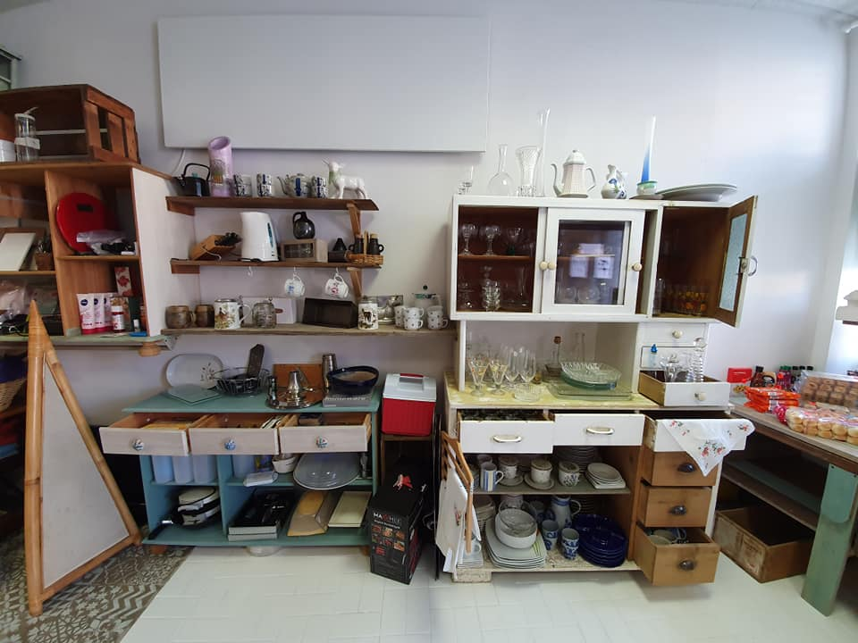
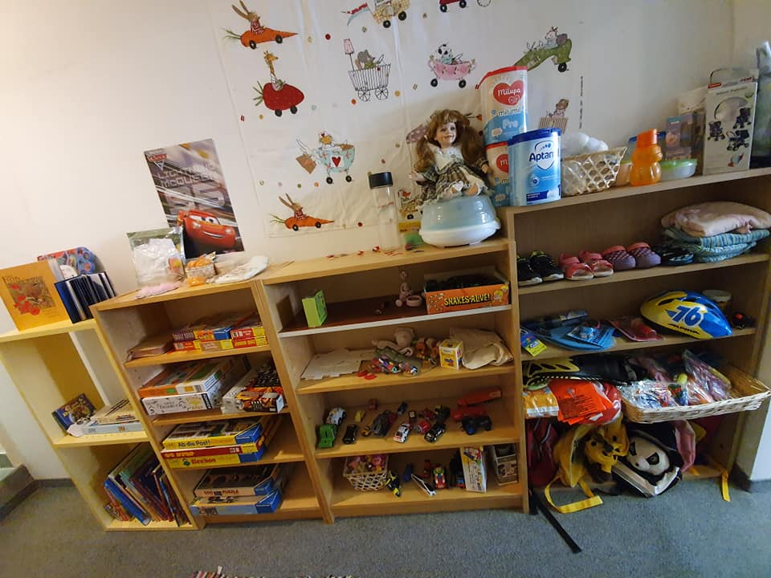

*27.04.2023*

**Fashion Revolution Week**

        

Wir befinden uns in der Fast Fashion Revolution Week. 👕👖 Denn die Textilindustrie ist ein Bereich wo wir unbedingt eine Veränderung brauchen. Diese Aktionswoche dreht sich jedes Jahr um den Fast Fashion Revolution Day - den 24. April. Denn am 24. April 2013 stürzte in Bangladesh das Rana Plaza Gebäude ein. Ein Gebäude in dem Fast Fashion produziert wurde. Beim Einsturz kamen 1.135 Menschen ums Leben und über 2.400 Menschen wurden verletzt. Es war ein Unglück, das einfach nicht passieren hätte dürfen. Es war ein Tag mit so viel Leid und Trauer.
Trauer, die vermeidbar gewesen wäre, wenn die Fast Fashion Industrie nicht so wäre wie sie ist. Wenn die Modeindustrie die Preise nicht so niedrig wie möglich machen würde und man somit nicht überall Geld einsparen muss. Geld einsparen auf Kosten der Arbeiter. Geld auf Kosten der Arbeitssicherheit. Und diese mangelnde Arbeitssicherheit kostete so Vielen das Leben.
Wie kam es zu dem Unfall? Am Vortrag - den 23.4.2013 - wurden im Rana Plaza Gebäude Risse festgestellt und die Polizei verbot den Zutritt. Die Fabrikbetreiber haben die Angestellten gezwungen dennoch ihre Arbeit aufzunehmen. Im Bericht der Untersuchungskommission wurde grobe Fahrlässigkeit als Hauptursache genannt (minderwertige Baumaterialien, Bauland nicht geeignet für mehrgeschossiges Gebäude,...).
Und deswegen ist der Fashion Revolution Day jedes Jahr am 24. April. Es soll an jenen Tag im Jahre 2013 erinnern und dafür sorgen, dass sich in der Modeindustrie so viel verändert, dass solch ein Unglück nicht wieder passieren kann.
Denn dass in der Textilindustrie viele Menschen mit sehr schlechten Arbeitsbedingungen arbeiten, wissen vermutlich die Meisten. Aber dass diese Arbeitsbedingungen sehr oft lebensgefährlich sind, ist vermutlich den Wenigsten bewusst.

Fast Fashion  👕🧥👢👜 ist ein Geschäftsmodell in der Bekleidungsindustrie, bei dem es  - wie der Name schon vermuten lässt - um Schnelligkeit geht. Kollektionen werden schnell und trendbezogen designt und zu niedrigen Preisen produziert und verkauft. Doch unter diesem "schnell und billig" leiden neben der Qualität der Kleidungsstücke vor allem die Arbeiter entlang der gesamten Produktionskette und die Umwelt.

Der hohe Wasserbedarf und die große Wasserverschmutzung sind einer der größten Probleme der Textilindustrie. 👕💧 Viele Fabriken reinigen ihr Abwasser nicht. Somit kommen viele Chemikalien - wie sie beim Bleichen, Färben und Co eingesetzt werden - ungefiltert in die umliegenden Gewässer.
Zu diesem Thema gibt es eine sehr empfehlenswerte Dokumentation: 💦 "Vergiftete Flüsse - Die schmutzigen Geheimnisse der Textilindustrie" nachzusehen hier: https://www.youtube.com/watch?v=VVzFeRRHhgI

Der hohe Einsatz von Chemikalien in der Textilindustrie bei den einzelnen Produktionsschritten setzt nicht nur der Umwelt zu, sondern auch den Arbeitern. Da sehr selten ausreichend Schutzausrüstung zur Verfügung gestellt wird, bekommen die Arbeiter sehr oft gesundheitliche Probleme. Es beginnt beim Pestizideinsatz beim Baumwollanbau und geht über die diversen Arbeitsschritte wie Bleichen, Färben und Imprägnieren.
Die "Detox my Fashion" Kampagne - die von Greenpeace schon im Jahr 2011 ins Leben gerufen wurde - beschäftigt sich mit diesem Thema und fordert ein Umdenken und Transparenz bezüglich Chemikalien in der Textilindustrie.

Bei uns im KreisLa wollen wir der Fast Fashion das Modell des "Tauschen statt Kaufen" entgegen setzen und dies funktioniert unserer Meinung nach ganz prima. 😊 Unser KreisLa steht für Tauschen und den wertvollen Umgang mit Produkten. Es gibt so viele Kleidungsstücke, die schon existieren und die sollten wir nützen. Wir haben für euch eine Fotoreihe erstellt, die darstellen soll, was es für schöne Ware bei uns im KreisLa gibt. Sie soll darauf aufmerksam machen, dass man sich hier gut einkleiden kann.
Wir wollen auch dazu sagen, dass natürlich jedes Produkt einen Wert hat. Auch wenn bei uns kein Preis verlangt wird, hat doch jede Ware seinen Wert. Und genau darum geht es – wir müssen den Wert der Ressourcen mehr schätzen. Dies meinen wir nicht im Hinblick darauf wie viel etwas kostet. Sondern dass in jedem Kleidungsstück wertvolle Ressourcen drinnen stecken und diese sollten wir wertschätzen und damit sorgsam umgehen. Dies bedeutet eben nicht Vieles billig zu kaufen, sondern zu wissen was dahinter steckt, die Dinge lange zu verwenden und nicht achtlos in den Müll zu werfen.

Noch ein paar Zahlen rund um die Kleiderschränke der Österreicher:
👕 Im Schnitt besitzt jeder Österreicher 85 Kleidungsstücke, wobei hier große Unterschiede zwischen Frauen (106) und Männern (62) auftreten.
👖 Viele dieser Kleidungsstücke - ca. jedes achte - werden nur selten oder gar nicht getragen, das machen 72 Millionen in Österreichs Kleiderkästen aus.
🧥 Circa die Hälfte entsorgen ihre Kleidung auch wenn keine Mängel vorhanden sind, weil sie nicht mehr als modisch empfunden werden (56% der Frauen, 41% der Männer).
👕 50% der entsorgten Kleidungsstücken landen im Müll, nur wenig wird gespendet.
👖 Der Konsum von Mode hat sich von 2000 bis 2014 verdoppelt. Bis 2030 wird ein weiteres Wachstum von 60% prognostiziert.
🧥 Mehr als die Hälfte unserer Kleidung besteht mittlerweile ganz oder teilweise aus Kunstfaser (z.B. Polyester).
Im Kleidungsbereich werden die Auswirkungen der Konsum- und Wegwerfgesellschaft sehr deutlich - "Die Trends von heute sind der Müll von morgen".

Wir wollen noch unserem Fotographen danken. Der Dank geht an A. Wachter, der gleich bereit war bei so was mitzumachen und uns zu unterstützen. Vielen Dank für deine Zeit und dein Engagement. Für uns war es eine super Gelegenheit die Waren vom KreisLa in einem anderem Rahmen vorzustellen und wir hoffen unsere Fotoreihe hat euch Lust gemacht, bei uns im KreisLa vorbei zu schauen. Es sind immer tolle Stücke dabei und ein Tipp noch - einfach immer wieder vorbei schauen, da unser "Angebot" ständig wechselt. Die Kleidungsstücke, die wir in der Fotoreihe vorstellen, sind teilweise noch im KreisLa zu haben. Einfach bei unseren Ehrenamtlichen nachfragen.

Und zum Abschluss wollen wir noch genauer auf die Lösungen hinschauen. Denn genauso viele Probleme wie es in der Textilindustrie gibt, genauso viele Lösungen und Alternativen gibt es. Anhand der gesamten Konsumpyramide gibt es die unterschiedlichen Möglichkeiten - je nachdem welcher Typ man ist.

👕 Nutzen, was man hat: meistens ist der Kleiderkasten sowieso voll, also einfach nochmal genauer durch stöbern bzw auch hin zu Minimalismus gehen, denn wie viele Kleidungsstücke brauchen wir denn wirklich?
👗 Leihen/Mieten: für nicht alltägliche Produkte wie Kleider und Anzüge eine gute Möglichkeit
👖 Tauschen: dafür ist unser KreisLa perfekt bzw kann man auch im Privaten sehr nett Kleidertauschparties organisieren oder zu öffentlichen gehen (zB Kinderkleidertausch vom Das Storchennest)
👚 Selber machen: man kann sehr vieles mit recht wenig Aufwand selber machen und wenn man hier noch alte/kaputte Stoffe aufwertet und upcycelt sind noch mal mehr Ressourcen gespart.
👔 Second Hand: hier gibt es in Carla Läden und diversen Second Hand Läden viel zum Schökern. Auch schon mal was vom Vintage Kilo Sale gehört? Gerade dieses WE findet in Graz einer von BeThrifty statt und auch online sind bei Second Hand den Möglichkeiten keine Grenzen gesetzt (zB Vinted, Babäm Second Hand)
👕 Neu Kaufen: auch hier sind mittlerweile einige nachhaltig produzierte Produkte am Markt, (zB Lounge Cherie, Peaces.bio)

*21.03.2023*

**Repair Cafe und Saatguttausch**

Am Freitag war einiges los vor unserem KreisLa. Elektrogeräte wurden wieder funktionsfähig gemacht und Saatgut wurde getauscht.
Über 300 Samenpäckchen und an die 30 Pflänzchen wechselten die Besitzer. Vom Vogerlsalat über seltene Tomatensorten bis zur Indianerbanane wurde alles getauscht! Da noch einiges an Saatgut übrig geblieben ist, geht unser Samen-Rahmen bis Sonntag auf Wanderschaft, bitte nehmen was das Herz begehrt und wer möchte kann auch gerne noch Saatgut aufhängen.

   
  

*11.03.2023*

**Repair Cafe und Saatguttausch**

Gemeinsam geben wir deinem kaputten Elektrogerät eine zweite Chance, bring es in den KreisLa und wir starten mit dir einen Reparaturversuch!
Auch kleine Reparaturen wie Kleben oder Schrauben können wir gerne übernehmen! Eine Voranmeldung und Beschreibung des Problems erhöht die Wahrscheinlichkeit dass wir dir helfen können!

Vor der Türe kannst du gleich die Gelegenheit nutzen überschüssiges Saatgut und Jungpflanzen gegen die Schätze anderer GartenbesitzerInnen zu tauschen!
Bitte nur samenfeste Sorten, möglichst regional und aus biologischem Anbau mitbringen 🙂 Wir freuen uns über vorbereitete, beschriftete Säckchen, aber auch z.B. ein Marmeladeglas mit Saatgut zum selbst abfüllen kann gerne gebracht werden!

*13.01.2023*

**Stöpsel sammeln für den guten Zweck**

Wir sammeln im KreisLa schon seit gut einem halben Jahr Plastikstöpseln (zB von PET Flaschen). Sie werden gesammelt und dem Recycling Prozess zugeführt. Eine dafür spezialisierte Recyclingstelle bezahlt für die Stöpseln und das eingenommene Geld wird dann für karikative Zwecks gespendet.
Gerhard Bey fährt schon seit vielen Jahren in ganz Österreich herum und sammelt ehrenamtlich viele, viele Drehverschlüsse. Auch unsere Sammlung wird im Februar von ihm abgeholt.
Deswegen hier noch mal der Aufruf - bringt uns eure Stöpseln!
Denn nur wenn große Mengen gesammelt werden, zahlt sich dieser Aufwand auch aus. Wir werden den genauen Abholtermin, sobald wir ihn wissen, bekannt geben, damit auch wirklich alle Stöpseln rechtzeitig einlagen.

Was wird genau gesammelt?
NUR Stöpsel/Dreh-Verschluss (PP, PE und HD-PE) VON
* (PET-) Getränkeflaschen, Sirup, Plastik-Sektkorken,
* Verschluss von Mayonnaise, Ketchup, Senf Tuben und Flaschen
* Verschluss von Milch, Kakao Vanillemilch(Tetra-Pack), Joghurt-, und Molkedrink
* Verschluss von Vitamin-Brausetabletten(+Rohr), Nuss-Nougat-Brotaufstrichen
* Verschluss von Erdnuss-, Chips-, Tabak-Dosen
* Verschluss und ganze Verpackung von Kaugummidragees und Zuckerln
* Verschluss von Flüssigseife, Zahnpaste, Körpercreme, Duschgel, Haarshampoo
* Verschluss von Abwaschhilfe, Flüssigwaschmittel, Weichspüler, Scheuermittel
* Verschluss von Auto-Scheibenreiniger, Motoröl, Frostschutz
* Verschluss von Medikamente und Cremen [samt Tiegel - bitte unbedingt auswaschen]

Alle festen Plastik-Materialien aus PP, PE und HD-PE  
Die meisten Stöpsel/Verschlüsse/Materialien haben innen/unten den Aufdruck PP, PE oder auch HDPE
NICHT die dünnen Aufreisslaschen, die meist eine Alubeschichtung haben

*3.11.2022*

**Europäische Woche der Abfallvermeidung**

Von 19. bis 27. November findet wieder die Europäische Woche der Abfallvermeidung statt. 🌱🌍 Auch wir im KreisLa bieten ein Programm dazu an.
Am Samstag, 26.11. finden gleich zwei Sachen statt: Am Vormittag kann man beim Repair Cafe Elektrogeräte reparieren 🔌🪛 und am Nachmittag kann man beim Naturkosmetik Workshop seine eigenen Pflegeprodukte herstellen. 🛀
Am Sonntag, 27.11. werden wir Müll sammeln und wir freuen uns über tatkräftige Unterstützung. 🗑

*2.11.2022*

**Winter-Öffnungszeiten**

Der KreisLa hat ab November Freitag nachmittags geschlossen. 
Aktuelle Öffnungszeiten: DI 16-18, FR 9-12, SA 9-12

*1.10.2022*

**Kastanien-Häckseln**

Auch dieses Jahr laden wir wieder zum Kastanien-Häckseln für Waschpulver und Co auf den Frohnleitner-Hauptplatz! Am Freitag den 7.10.!
Der Häcksler steht während der Öffnungszeiten (9-12 und 15-18 Uhr) bereit - einfach Ross-Kastanien mitbringen und loshäckseln!
Von 15:30 bis 16:30 könnt ihr euch vor dem KreisLa über Waschen mit Pflanzen und umweltfreundliches Waschen informieren!

*29.9.2022*

**Lastenrad-Tag**

Im Rahmen der europäischen Mobilitätswoche fand am 19.9. am Frohnleitner Hauptplatz ein "Lastenrad-Tag" statt. Es wurden 12 Lastenräder zum Testen bereit gestellt und viele, viele Runden damit am Hauptplatz gedreht.

   
  

*20.6.2022*

**Sammelboxen**

Wir haben ein paar Sammelboxen aufgestellt und wollen auch Dinge, die nicht direkt wieder verwendet werden können, im Kreislauf halten.

🖨 Druckerpatronen: Für Leib & Söl - Verein sammeln wir leere originale Druckerpatronen (Laser- und Tintenstrahldrucker). Nachbau-Patronen gehen leider nicht.

🍾 Korken: gehen an "Korken Schiesser", die sie dann recyceln (korken.at/recycling)

🛒 Stöpsel (PP, PE und HD-PE) von (PET-)Flaschen: gehen an den Verein "Helfen statt Wegwerfen - Stöpsel Sammeln". Hier gibt es genaue Infos was gesammelt wird: helfenstattwegwerfen.at/sammelgut.html

🕯 Wachs- und Kerzenreste jeder Größe: um neue Kerzen daraus zu machen

 

*20.6.2022*

**Ein Jahres Fest**

Am 4.6. hat der KreisLa seinen ersten Geburtstag gefeiert. Es war ein schönes Fest mit euch! Wir freuen uns auf ein tolles zweites Jahr!

   

 

*3.5.2022*

**Wir feiern unser einjähriges Bestehen und laden zum Geburtstagsfest!**

*2.5.2022*

**Neue Öffnungszeiten**

Der KreisLa hat ab Mai auch wieder am Freitag Nachmittag geöffnet. 
Aktuelle Öffnungszeiten: DI 16-18, FR 9-12 & 15-18, SA 9-12

*20.4.2022*

**Vortrag "Nachhaltige Mode" ist abgesagt**

*7.4.2022*

Jedes Jahr findet von 18. bis 24. April die Fashion Revolution Week statt. In dieser Aktionswoche soll auf die Probleme der Fast Fashion Industrie hingewiesen werden. Und diese Probleme sind sehr vielfältig - mit sehr schlechten Auswirkungen auf Mensch und Umwelt: angefangen von den miserablen Arbeitsbedingungen über enormen Wasserbedarf und Wasserverschmutzung hin zu einem sehr hohem Chemikalieneinsatz.
Warum diese Aktionswoche genau zu diesem Datum stattfindet hat einen sehr tragischen Grund: Am 24. April 2013 stürzte in Bangladesh das "Rana Plaza" Gebäude ein. Ein Gebäude in dem Fast Fashion produziert wurde. Beim Einsturz kamen 1.135 Menschen ums Leben und über 2.400 Menschen wurden verletzt. Es war ein Unglück, das einfach nicht passieren hätte dürfen. Es war ein Tag mit so viel Leid und Trauer. Trauer, die vermeidbar gewesen wäre, wenn die Fast Fashion Industrie nicht so wäre wie sie ist.

Im Rahmen der Fashion Revolution Week wollen auch wir in Frohnleiten auf dieses Thema aufmerksam machen. Wir wollen auf die Probleme der Fast Fashion hinweisen. Und wir wollen auch Lösungen aufzeigen. Denn es gibt genug Wege raus aus dieser Fast Fashion Industrie. 
Gemeinsam mit Lounge Cherie und Mamanita haben wir drei Veranstaltungen organisiert. Merkt euch die Termine schon mal vor. Näheres zu den einzelnen Veranstaltungen gibt es in den nächsten Tagen.

*1.4.2022*

**Programm im Frühling**

Wir starten mit unserem Programm in den Frühling. Schaut vorbei und besucht uns bei den diversen Veranstaltungen.

*17.10.2021*

**Kastanien Häckseln**

Gestern drehte sich vor unserem KreisLa alles um das Thema "Waschen mit Pflanzen". Es wurden viele Informationen ausgetauscht und viele Kastanien zerkleinert. Wer Interesse hat, wie das Waschen mit Kastanien funktioniert, findet hier viele Infos dazu: https://www.umweltberatung.at/naturwaschmittel-aus-rosskastanien

Ihr könnt natürlich auch gerne bei uns nachfragen (wir haben auch Kostproben).



*4.10.2021*

**Waschen mit Pflanzen**

*3.10.2021*

**Modenschau**

Am 1.10. nahmen wir beim Late Night Shopping mit Modenschau teil. Es war für uns eine gute Gelegenheit unsere schönen Outfits zu präsentieren.



*12.9.2021*

**Fotos Radtag**

Bei unserem Radtag mitten am Frohnleitner Hauptplatz wurde auf das Thema "Nachhaltige Mobilität" aufmerksam gemacht.



*8.9.2021*

**Europäische Mobilitätswoche**

Im Rahmen der Mobilitätswoche finden einige Veranstaltungen in und rund um Frohnleiten statt - beginnend mit unserem Radtag am 17.9. vor unserem KreisLa. Kommt mit eurem Rad vorbei, lasst es durchchecken, probiert unseren Parcours aus und nehmt somit an unserem Gewinnspiel teil.

*5.9.2021*

**Wir machen Urlaub**

*16.8.2021*

*7.7.2021*

**Repair Cafè**

Unser erstes Repair Cafè für elektrische Geräte findet am 17.7.2021 von 9 bis 12 vor unserem KreisLa statt.

*17.6.2021*

**Unser KreisLa hat eröffnet**

Der Kreislauf-Laden hat seit Anfang Juni jede Woche 4x geöffnet und wir freuen uns sehr über die zahlreichen Gäste, die bisher schon gekommen sind und in der nächsten Zeit noch kommen werden.
Es wurde schon vielen Dingen ein zweites Leben geschenkt - angefangen von Geschirr über Kleidung und Kindersachen hin zu Deko und Co.

Schaut vorbei und stöbert durch!

     

    

*21.5.2021*

Unser Herzensprojekt geht in die nächste Phase!

**Eröffnung KreisLa am Freitag den 4.6.2021, 9-12 und 15-18 Uhr**

Der Kreislauf-Laden direkt am Frohnleitner Hauptplatz soll Ressourcen schonen, indem Gegenständen ein zweites Leben gegeben wird. Bringt uns Dinge die ihr nicht mehr braucht und nehmt Dinge aus dem KreisLa mit, die ihr brauchen könnt.

Am 29.5 und am 30.5 werden bereits Waren angenommen, danach ist eine Warenannahme immer während der Öffnungszeiten möglich. Bitte keine Waren einfach vor dem Geschäftslokal abstellen! Ansonsten uns auch gerne per Mail kontaktieren, bezüglich eines Termines für Warenannahme.

Derweil wird noch fleißig geplant und umgebaut.


