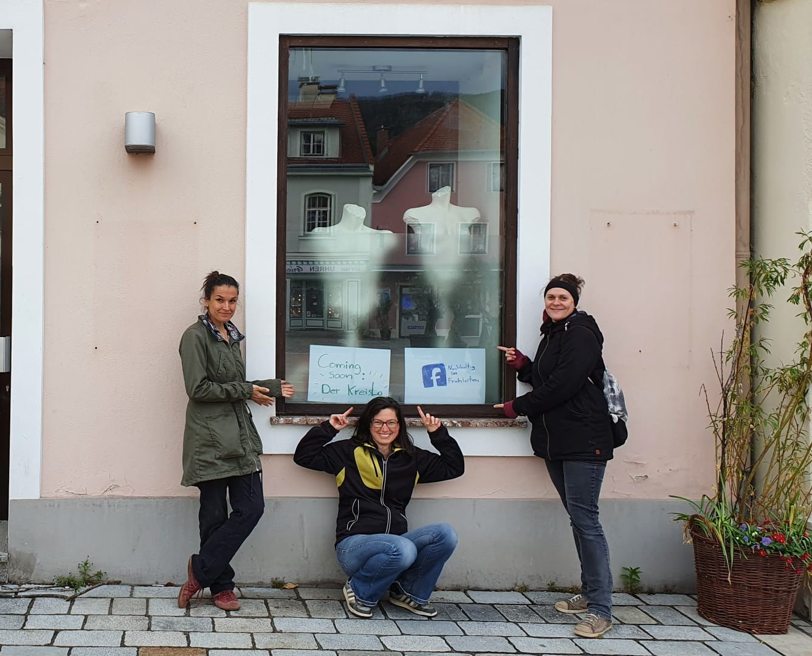
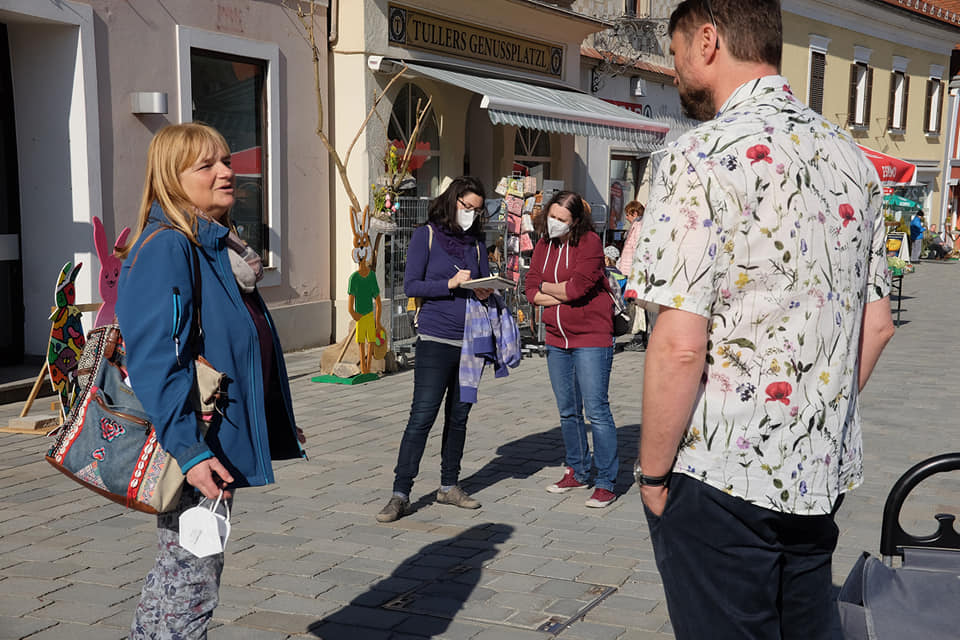
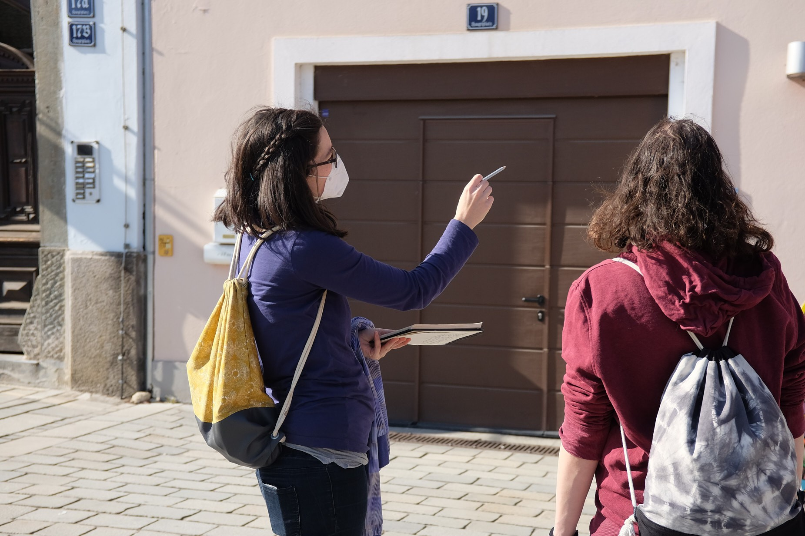

Unser Herzensprojekt geht in die Eröffnung!
Eröffnung KreisLa am Freitag den 4.6.2021, 9-12 und 15-18 Uhr

Der Kreislauf-Laden direkt am Frohnleitner Hauptplatz soll Ressourcen schonen, indem Gegenständen ein zweites Leben gegeben wird. Bringt uns Dinge die ihr nicht mehr braucht und nehmt Dinge aus dem KreisLa mit, die ihr brauchen könnt.

Am 29.5 und am 30.5 werden bereits Waren angenommen, danach ist eine Warenannahme immer während der Öffnungszeiten möglich. Bitte keine Waren einfach vor dem Geschäftslokal abstellen! Ansonsten uns auch gerne per Mail kontaktieren, bezüglich eines Termines für Warenannahme.

Derweil wird noch fleißig geplant und umgebaut.



  

  

  
