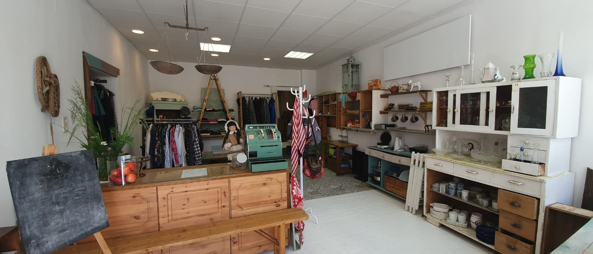

Der KreisLa steht für Kreislauf-Laden und es ist ein Kostnixladen. Dies bedeutet: Funktionstüchtige Dinge die man zuhause nicht mehr braucht, können in den Laden gebracht werden und man kann Dinge, die im Laden sind (die jemand anderer gebracht hat) mit nach Hause nehmen.
Es ist also ein Tauschprinzip dahinter – Geben und Nehmen. Wobei man natürlich auch nur geben oder nur nehmen kann.

Der KreisLa ist für alle da - unabhängig von Einkommen, Alter und Lebensstil – die Umwelt zu schonen geht nämlich uns alle etwas an. Kostnixläden werden oft mit “Sozialläden” verwechselt, die zum Ziel haben Menschen in finanziellen Schwierigkeiten Dinge zur Verfügung zu stellen. Tatsächlich ist der Grundgedanke der meisten Kostnixläden aber gut brauchbare Dinge vor dem Müll zu bewahren. Alle sind eingeladen Dinge zu bringen, zu stöbern und ein bisschen Zeit im KreisLa zu verbringen.

Gemeinsam mit der Caritas werden auch gerettete Lebensmittel angeboten. Lebensmittel – die kurz vor oder nach dem Mindesthaltbarkeitsdatum stehen – werden von Supermärkten abgeholt und im Laden verschenkt.
Somit kann auch im Bereich Nahrungsmittel einiges an Ressourcen geschont werden.

Die MitarbeiterInnen die während den Öffnungszeiten den Laden betreuen (Waren entgegennehmen, einsortieren, zusammenräumen, usw.), engagieren sich ehrenamtlich. Wer sich einbringen möchte kann gerne per Mail Kontakt aufnehmen.

Der Verein möchte außerdem mit dem Laden auf das Thema Nachhaltigkeit und Umweltschutz aufmerksam machen. Es werden Möglichkeiten geboten um den eigenen Alltag und den Konsum nachhaltiger zu gestalten. Dazu finden zusätzlich auch regelmäßig Repair Cafes statt und auch sonstige diverse Veranstaltungen.


