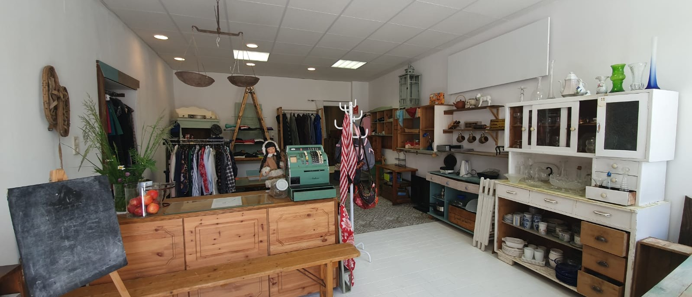

**Entdecke den KreisLa – Der Kreislaufladen in Frohnleiten**                

Im Herzen von Frohnleiten gelegen, bietet der KreisLa einen offenen Raum für die Gemeinschaft um intakte, saubere und funktionsfähige Gegenstände zu tauschen und weiterzuverwenden. In einem liebevoll restaurierten historischen Gebäude bietet der KreisLa weit mehr als ein klassisches Ladenkonzept – es ist ein Begegnungsort für Nachhaltigkeit. Hier können sich die Bürger:innen an Veranstaltungen beteiligen, sich über nachhaltige Initiativen informieren und praktische, umweltfreundliche Ressourcen entdecken, die sie auf ihrem Weg zu einem grüneren Leben unterstützen.



**Wir sammeln**

In allen Produkten stecken wertvolle Rohstoffe drinnen. Um möglichst viele Rohstoffe im KreisLauf zu halten, sammeln wir im KreisLa diverse Sachen. Einfach im KreisLa während den Öffnungszeiten abgeben:

🕯️ Kerzenreste: daraus werden von uns (oder Kooperationspartnern) neue Kerzen gegossen

🍾 Korken: werden zu “Korken Schiesser” geschickt und so recycelt im Projekt ReKork (korken.at/recycling)

🖨️ Toner-/Druckerpatronen: werden für die “österreichische Kinderkrebshilfe” gesammelt (sozialprojekt.at)

👓 Optische Brillen: gehen an “Brillen ohne Grenzen” (brillen-ohne-grenzen.at)

