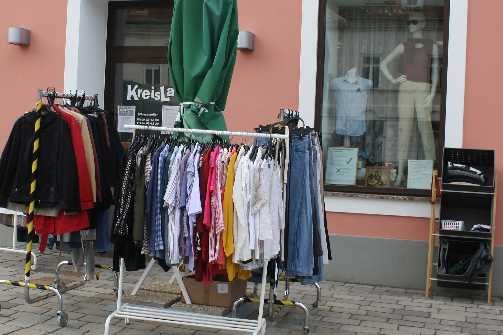
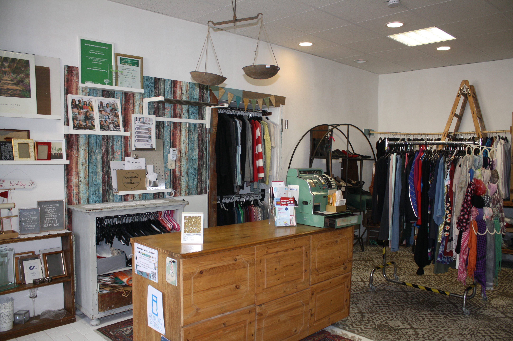
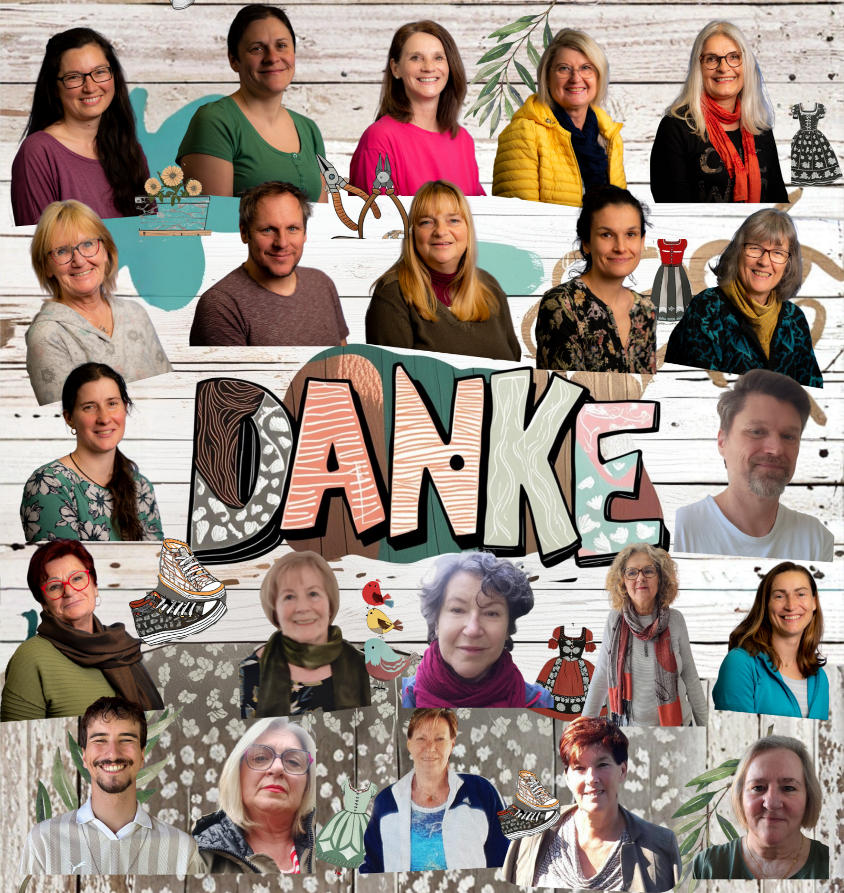

---
title: "KreisLa" 
--- 

**Entdecke den KreisLa – Der Kreislaufladen in Frohnleiten**                     

Im Herzen von Frohnleiten gelegen, bietet der KreisLa einen offenen Raum für die Gemeinschaft um intakte, saubere und funktionsfähige Gegenstände zu tauschen und weiterzuverwenden. In einem liebevoll restaurierten historischen Gebäude bietet der KreisLa weit mehr als ein klassisches Ladenkonzept – es ist ein Begegnungsort für Nachhaltigkeit. Hier können sich die Bürger:innen an Veranstaltungen beteiligen, sich über nachhaltige Initiativen informieren und praktische, umweltfreundliche Ressourcen entdecken, die sie auf ihrem Weg zu einem grüneren Leben unterstützen.

 



   

Unser KreisLa ist nur Dank unseres großartigen Teams so ein toller Ort geworden. Seit über fünf Jahren wird der KreisLa von Menschen getragen, die ihre Zeit, Ideen und Energie investieren, um Nachhaltigkeit, Gemeinschaft und Weiterverwenden in Frohnleiten zu fördern. Dafür möchten wir von Herzen Danke sagen!

