**Repair Cafés - Gemeinsam Reparieren, Nachhaltigkeit Fördern**

Mindestens viermal im Jahr lädt der Verein "Nachhaltig in Frohnleiten" zu Repair Cafés ein, bei denen defekte Alltagsgegenstände gemeinsam repariert werden. Diese Veranstaltungen fördern nicht nur die Langlebigkeit von Produkten, sondern stärken auch das Gemeinschaftsgefühl und vermitteln wertvolles praktisches Wissen.
Die Termine in der zweiten Hälfte 2026: 20.6. von 10-15 Uhr (im Rahmen des Umweltfestes am Hauptplatz), 19.9. und 7.11. jeweils von 10-12 im Jufo (Hauptplatz 39).

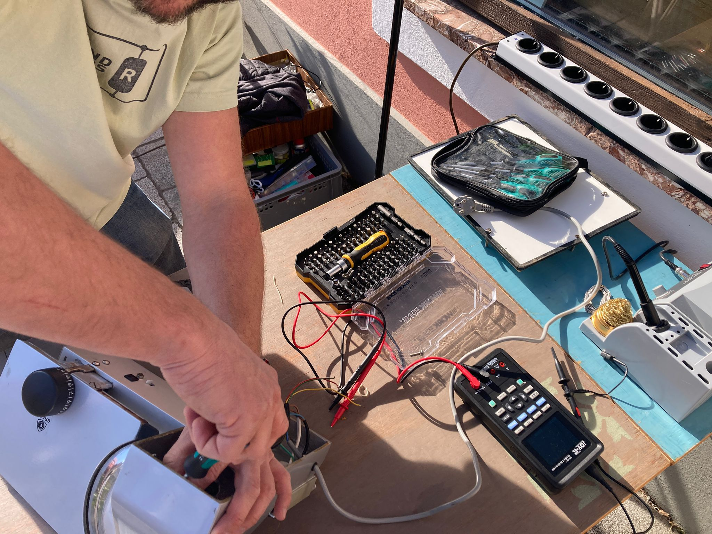 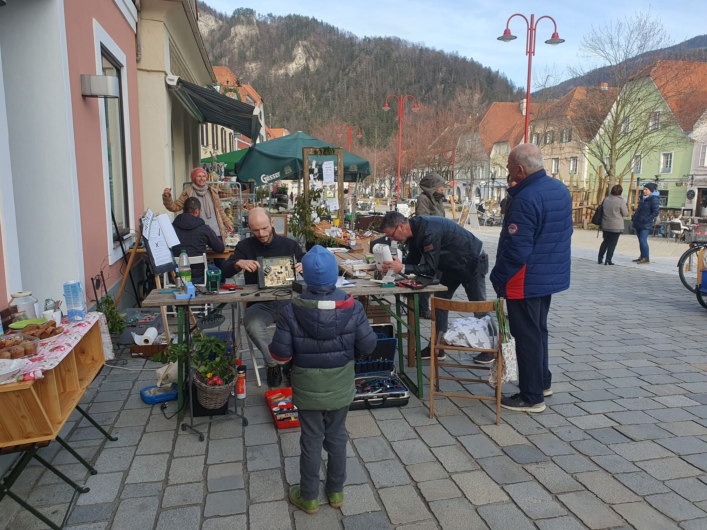
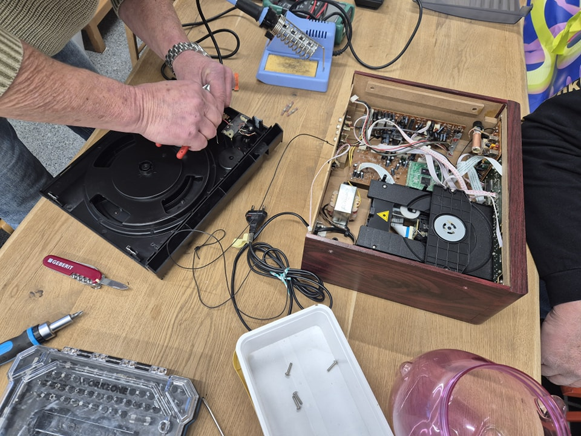 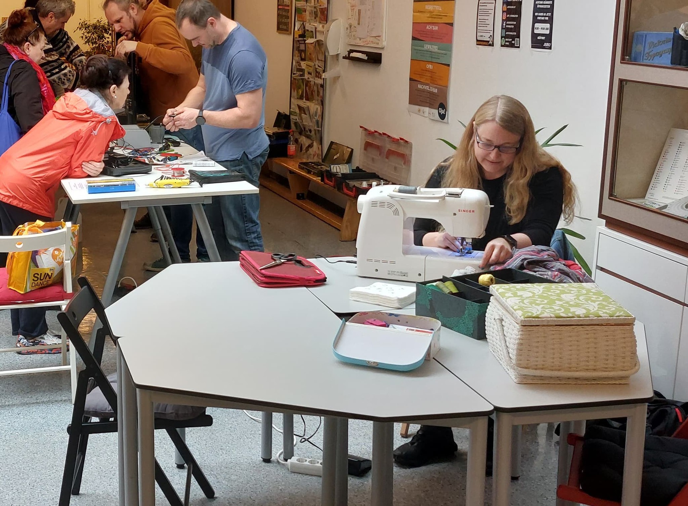

**Kooperationen**

In Zusammenarbeit mit der Caritas Ortsgruppe werden gerettete Lebensmittel im KreisLa angeboten. Diese stammen von Supermärkten und stehen kurz vor oder knapp nach dem Mindesthaltbarkeitsdatum. Indem wir diese Lebensmittel kostenlos weitergeben, helfen wir Ressourcen im Bereich Nahrungsmittel zu schonen.
Austausch mit Partnerorganisationen wie der Klimaregion Graz-Nord stärken die regionale Zusammenarbeit und bündeln Ressourcen für nachhaltige Projekte. So haben wir das Tauschregal im Storchennest (Eltern-Kind-Zentrum), die Schultaschenaktion mit dem Elternverein der Volksschule Frohnleiten, Trachtenflohmarkt vom Verein Ehrenpreis, gemeinsame Veranstaltungen (wie Radfeste, Umweltfest), die Repair Cafès im Jufo (Jugendzentrum) und immer wieder ergeben sich neue Kooperationen.

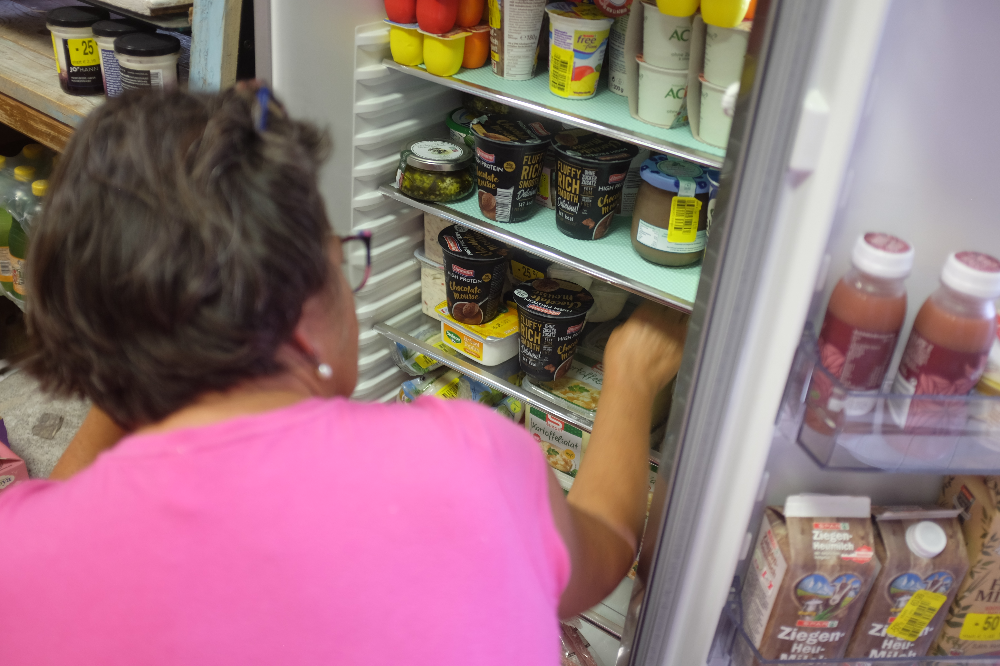 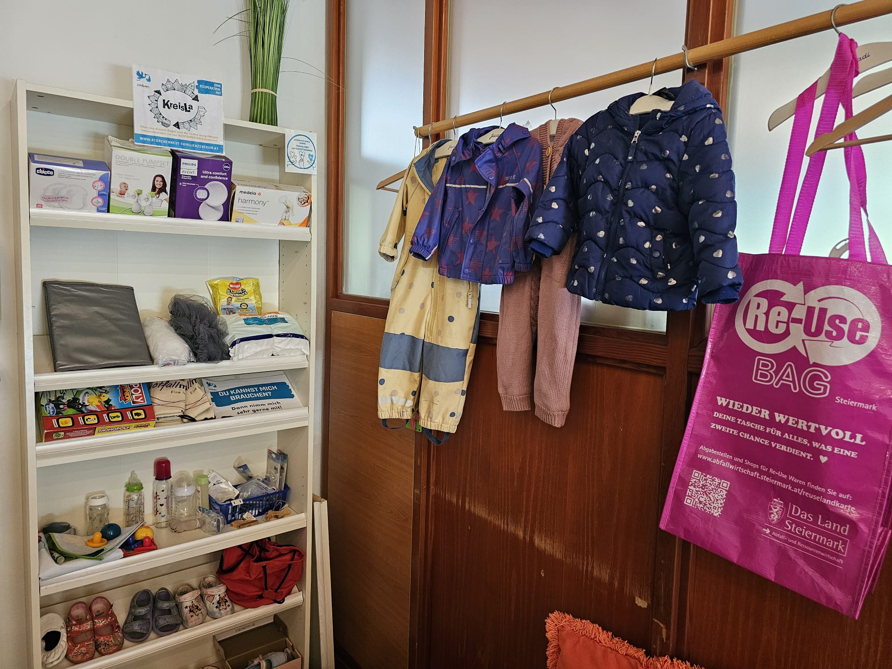 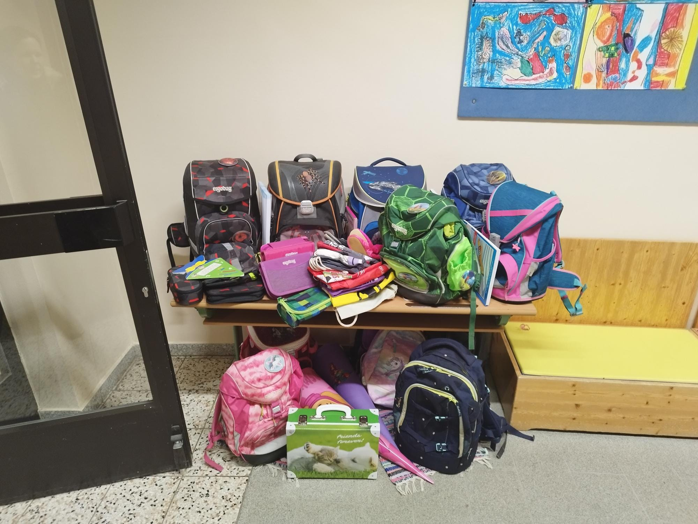  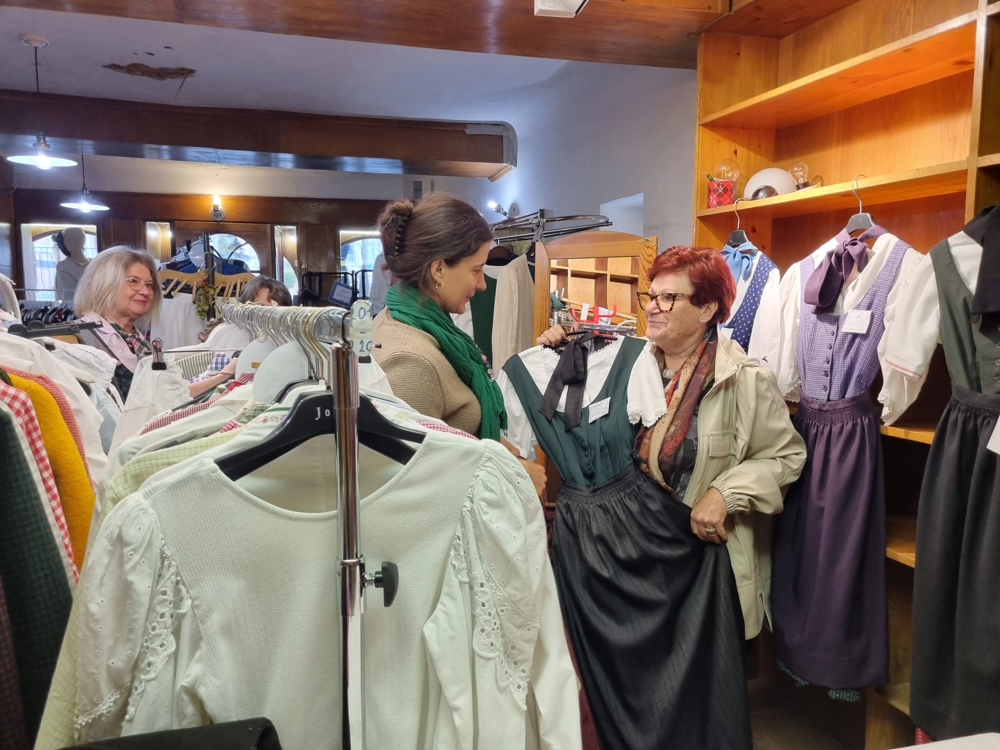 

**Saatgut- und Jungpflanzentausch - Nachhaltigkeit im Alltag**

Unsere Saatgut- und Jungpflanzentausch-Aktionen im Frühling bieten der Gemeinschaft die Möglichkeit Pflanzen und Samen auszutauschen und Wissen über Gartenbau und nachhaltige Landwirtschaft weiterzugeben.

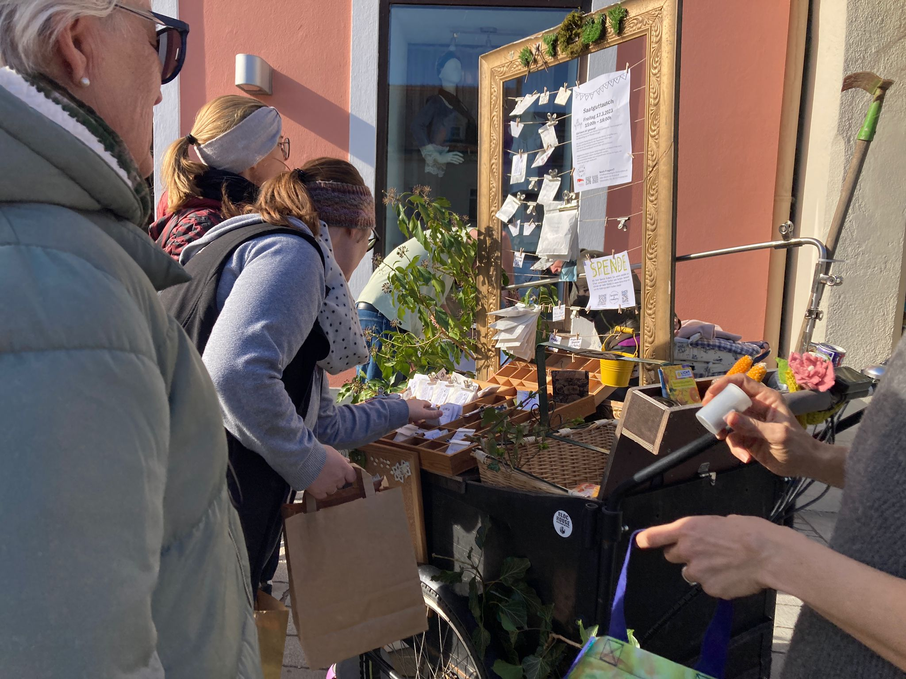 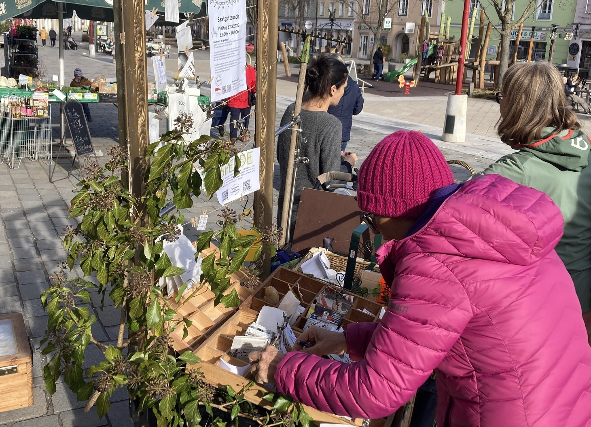 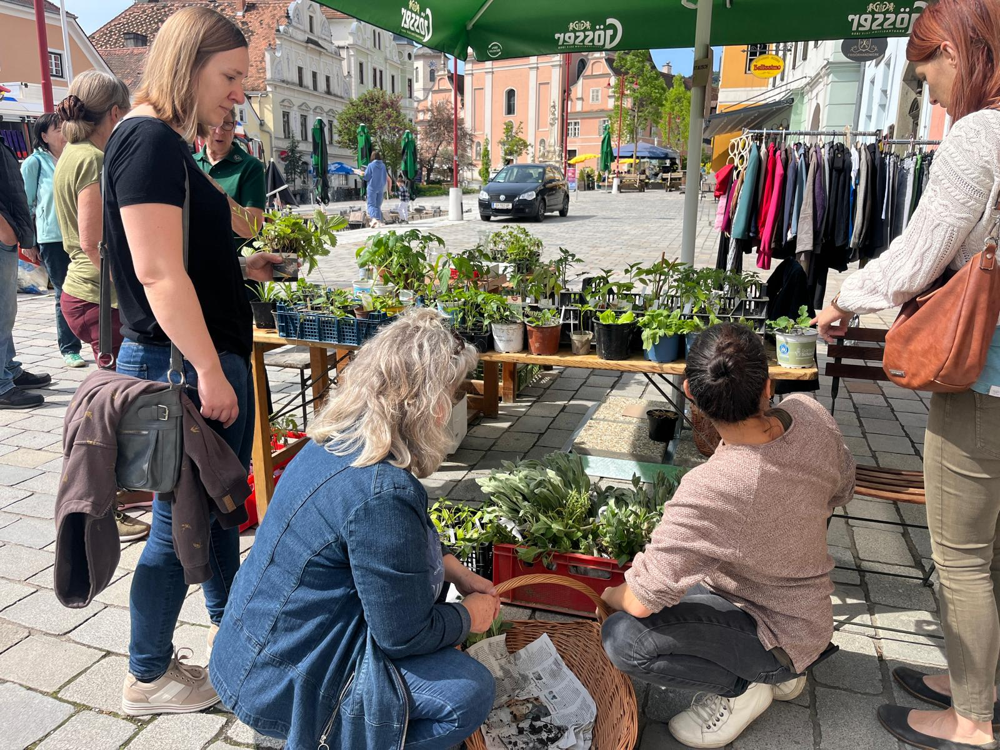 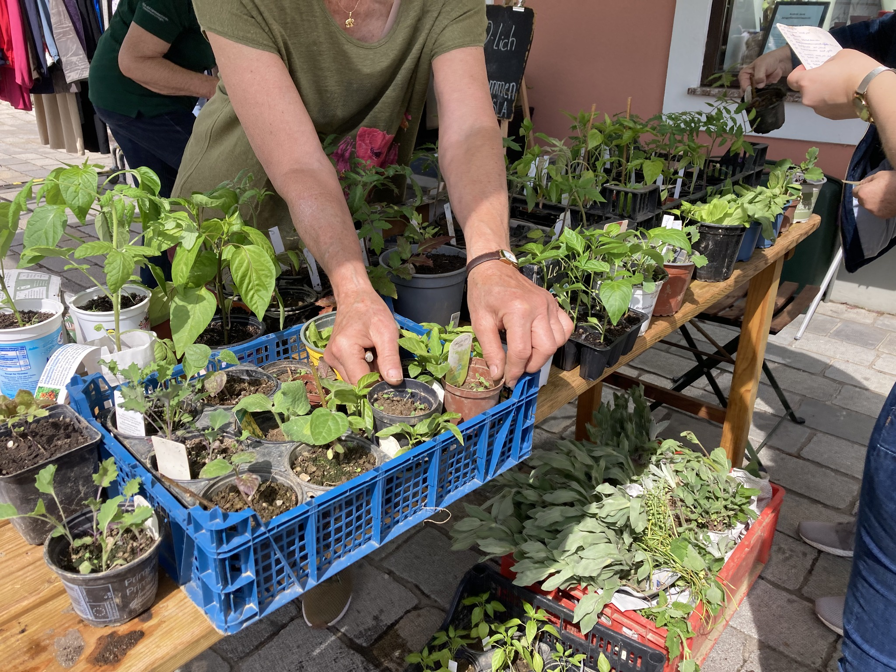 

**Zukunftspreis**

Wir freuen uns sehr, dass wir 2024 mit dem 2. Platz für die Zukunftsgemeinde Steiermark ausgezeichnet wurden. Die Zusammenarbeit mit der Stadtgemeinde und regionalen Akteuren schafft ein breites Netzwerk, das die Nachhaltigkeitsziele der Region unterstützt. Mit unseren Projekten wollen wir auch zur Belebung des Stadtzentrums beitragen und sind jederzeit offen für Vorschläge und Wünsche zu Workshopthemen. Auch Freiwillige sind willkommen, melde dich bei uns per Mail oder direkt im KreisLa, es gibt viele Möglichkeiten sich einzubringen.

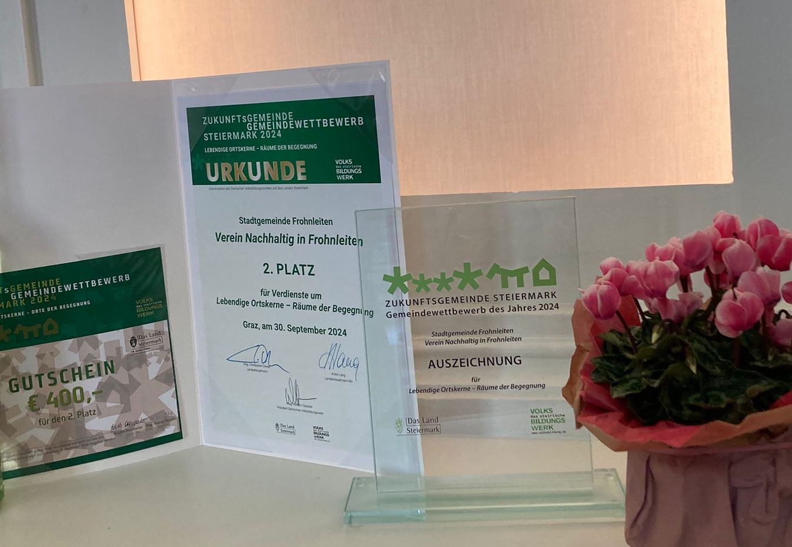 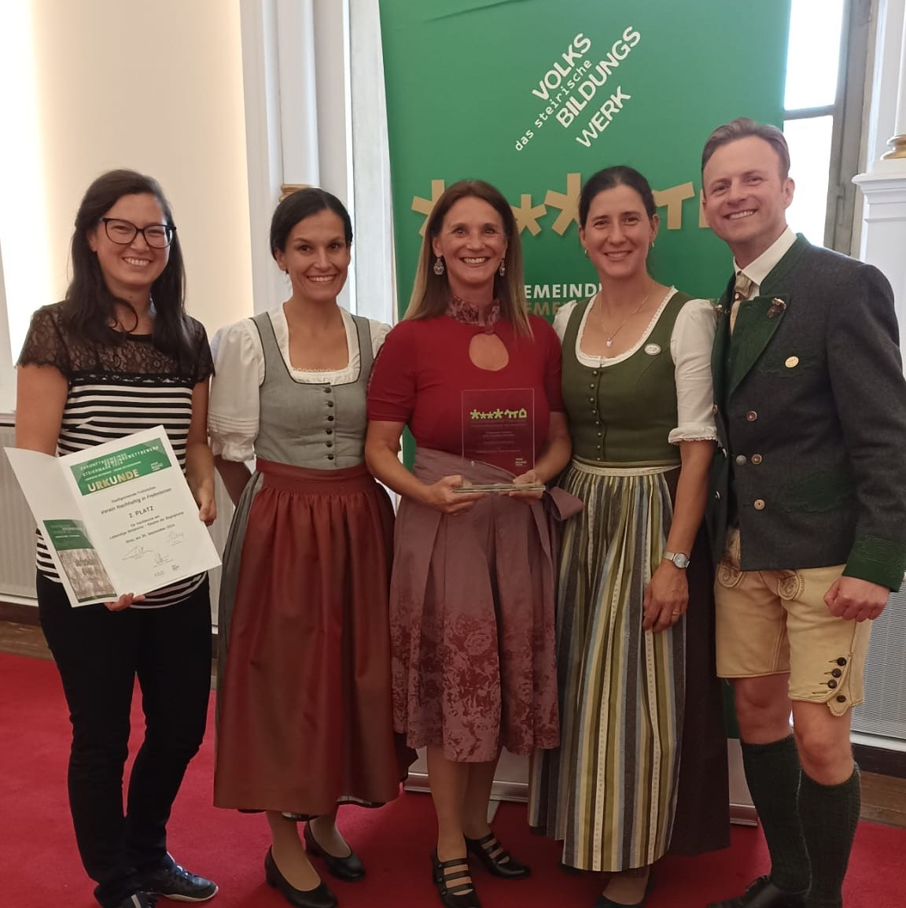 
