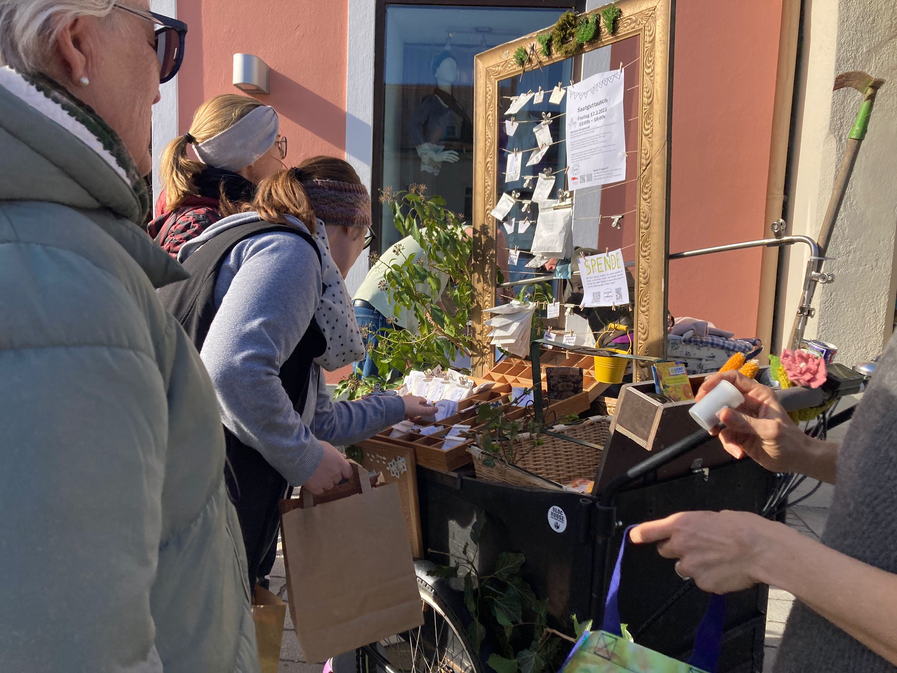

**Repair Cafés - Gemeinsam Reparieren, Nachhaltigkeit Fördern**

Mindestens viermal im Jahr lädt der KreisLa zu Repair Cafés ein, bei denen defekte Alltagsgegenstände gemeinsam repariert werden. Diese Veranstaltungen fördern nicht nur die Langlebigkeit von Produkten, sondern stärken auch das Gemeinschaftsgefühl und vermitteln wertvolles praktisches Wissen.

 

**Trachtenflohmarkt und Veranstaltungen im Stadtkern**

Unsere jährlichen Trachtenflohmärkte, die in Zusammenarbeit mit Vereinen wie dem Musikverein Frohnleiten organisiert werden, beleben das Stadtzentrum und tragen zur Erhaltung historischer Gebäude bei. Neben dem Flohmarkt sorgen zusätzliche Events wie Modenschauen und Verlosungen für Abwechslung und binden lokale Partner ein, um nachhaltige Kleidung und regionale Produkte zu fördern.

 

**Jugendzentrum „JUFO“ - Nachhaltige Räume für die nächste Generation**

In Kooperation mit dem Jugendzentrum JUFO unterstützt der Verein die nachhaltige Gestaltung der neuen Räumlichkeiten am Hauptplatz und ermöglicht Jugendlichen, sich aktiv in Nachhaltigkeitsprojekte einzubringen. Durch finanzielle Beiträge und direkte Unterstützung stärkt der Verein das Engagement der Jugend für eine grünere Zukunft und bietet wertvolle Lernmöglichkeiten.

 

**Lebensmittel retten**

In Zusammenarbeit mit der Caritas Ortsgruppe werden auch gerettete Lebensmittel angeboten. Diese stammen von Supermärkten und stehen kurz vor oder knapp nach dem Mindesthaltbarkeitsdatum. Indem wir diese Lebensmittel kostenlos weitergeben, helfen wir, Ressourcen im Bereich Nahrungsmittel zu schonen.

 

**Saatguttausch und Kleidertauschbörsen - Nachhaltigkeit im Alltag**

Unsere Saatgut- und Jungpflanzentausch-Aktionen bieten der Gemeinschaft die Möglichkeit, Pflanzen und Samen auszutauschen und Wissen über Gartenbau und nachhaltige Landwirtschaft weiterzugeben. Regelmäßig organisierte Kleidertauschbörsen fördern die Wiederverwendung und tragen zur Reduzierung von Abfall bei.
Ein Beitrag zur nachhaltigen Zukunft von Frohnleiten

 

**Umwelt-Workshops und Kooperationen**

Regelmäßige Workshops zu umweltfreundlichen Themen sowie Partnerschaften mit lokalen Schulen und Kindergärten fördern das Umweltbewusstsein bei Kindern und Jugendlichen und zeigen praktische Wege auf, Nachhaltigkeit im Alltag zu leben. Netzwerkveranstaltungen und der Austausch mit Partnerorganisationen wie der Klima- und Energie-Modellregion (KEM) und der Klimawandelanpassungsmodellregion (KLAR) Graz-Nord stärken die regionale Zusammenarbeit und bündeln Ressourcen für nachhaltige Projekte.

**Zukunftspreis**

Wir freuen uns sehr, dass wir 2024 mit dem 2. Platz für die Zukunftsgemeinde Steiermark ausgezeichnet wurden. Die Zusammenarbeit mit der Stadtgemeinde und regionalen Akteuren schafft ein breites Netzwerk, das die Nachhaltigkeitsziele der Region unterstützt. Mit unseren Projekten wollen wir auch zur Belebung des Stadtzentrums beitragen und sind jederzeit offen für Vorschläge und Wünsche zu Workshopthemen. Auch Freiwillige sind willkommen, melde dich bei uns per Mail oder direkt im KreisLa, es gibt viele Möglichkeiten sich einzubringen.

 
