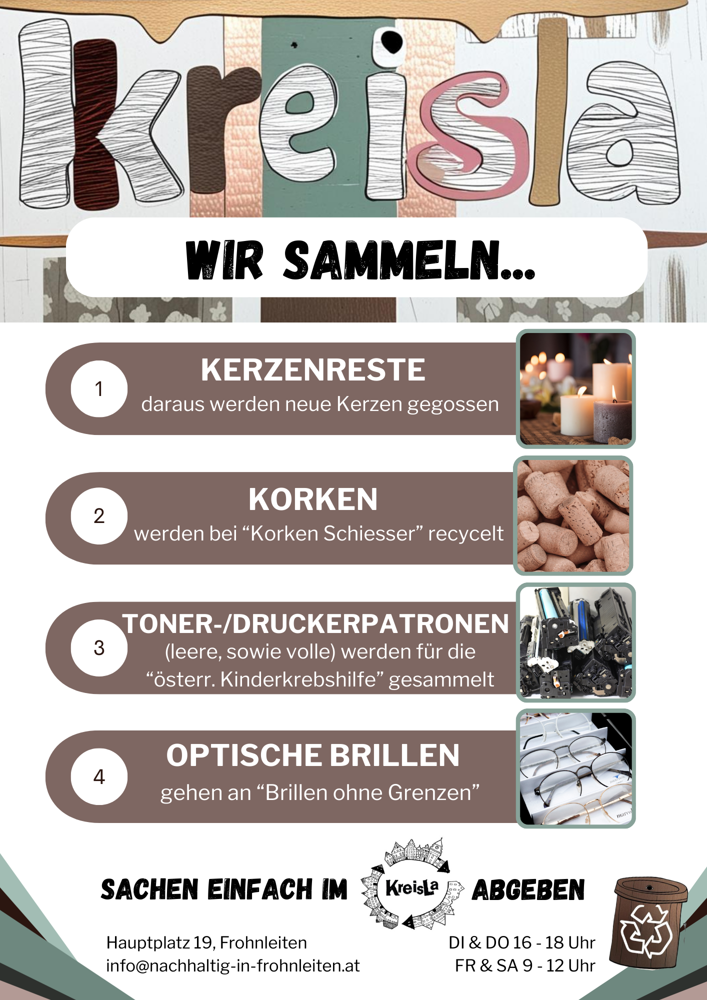

**Was kann gebracht werden?**

Bitte bring nur intakte, saubere und saisonale Gegenstände mit – Dinge, die du auch Freunden schenken würdest. Folgende Artikel sind willkommen:
- Kleidung (ohne Flecken und Löcher)
- Kindersachen (Gewand, Spielzeug, Zubehör,...)
- Geschirr und Küchenutensilien
- Heimtextilien (Bettwäsche, Vorhänge, bitte keine Decken und große Pölster ohne Absprache)
- Werkzeuge
- Elektrokleingeräte (nur funktionierende)
- Sportartikel
- Schuhe (nur neuwertige!)
- Accessoires (Taschen, Tücher, Schmuck)
- Kosmetikartikel
- Spiele (Brettspiele, Kartenspiele)
- Dekoartikel (Bilder, saisonales Dekomaterial)

Unser Platz ist sehr begrenzt und wir können nur annehmen, was in den Laden passt. Wir bitten um Verständnis!
Nicht angenommen werden: CDs, DVDs, VHS-Kassetten, Audiokassetten und Bücher

**Wir sammeln**

In allen Produkten stecken wertvolle Rohstoffe drinnen. Um möglichst viele Rohstoffe im KreisLauf zu halten, sammeln wir im KreisLa diverse Sachen. Einfach im KreisLa während der Öffnungszeiten abgeben. Relevante Links dazu: korken.at/recycling, sozialprojekt.at (Druckerpatronen), brillen-ohne-grenzen.at

Wir sammeln auch in Kooperation mit dem Elternverein der Volksschule Frohnleiten Schultaschen und sonstiges Zubehör (Federpenal, Turnsackerl,...). Diese werden dann an andere Schüler:innen weitergegeben und so bleiben die Ressourcen im KreisLauf.

**Wie viel kann gebracht und genommen werden?**

**Bringen**: Es gibt keine feste Begrenzung für die Anzahl der Gegenstände, die gebracht werden können. Als Richtwert gilt jedoch: Bringe bitte nur so viel, wie du selbst tragen kannst (z.B. eine Bananenschachtel voll). Da wir nur begrenzten Platz haben, bitten wir darum, Kleidung und andere Artikel nicht in großen Mengen mitzubringen. Wenn du Dinge abgeben möchtest, übergib sie bitte direkt unseren MitarbeiterInnen während der Öffnungszeiten – bitte keine Sachen vor der Tür abstellen. 

**Mitnehmen**: Als Orientierung empfehlen wir, dass jede Person etwa 10 Gegenstände mitnimmt, abhängig von deren Größe und Art. Wir behalten uns vor, für bestimmte Gegenstände pro Person eine Mengenbegrenzung festzulegen. Der Laden funktioniert nur, wenn jeder und jede auch an die anderen denkt und nur mitnimmt, was er oder sie wirklich braucht.
Sollte ein Gegenstand aus dem Laden später nicht mehr benötigt werden, freuen wir uns, wenn du ihn einfach wieder zurückbringst.

**Wichtig**: Auch kostenlose Dinge haben einen Wert. Nimm daher nur das mit, was du wirklich selbst benötigst und verwende die Gegenstände für den persönlichen Gebrauch (nicht zum Weiterverkauf). Wenn du etwas für Freunde oder Verwandte mitnehmen möchtest, bring sie am besten selbst mit oder sprich geplante Spendenaktionen oder Sonderfälle direkt mit uns ab.

**Hinweis zur Fairness**: Da es für uns schwer einzuschätzen ist, wann das Bringen größerer Mengen in Ordnung ist, bitten wir um ein kurzes Gespräch oder eine E-Mail vorab. So können wir Missverständnisse vermeiden.
