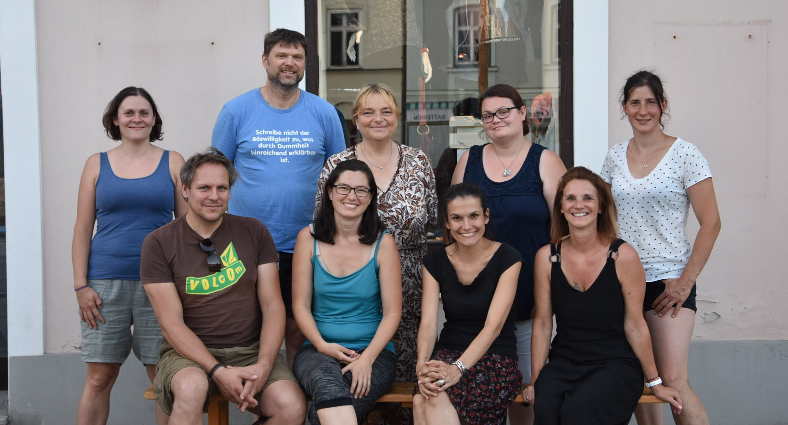

Schön, dass du hier bist!

Aktuelle Informationen wie Öffnungszeiten und Veranstaltungen findest du auf:
* Cities: citiesapp.com/pages/nachhaltig-in-frohnleiten
* Facebook: fb.com/nachhaltiginfrohnleiten
* Instagram: instagram.com/nachhaifro

Bei Fragen und Anliegen erreicht ihr uns unter:
* Email: info@nachhaltig-in-frohnleiten.at
* im KreisLa: Hauptplatz 19, 8130 Frohnleiten

Wir sind der Verein "Nachhaltig in Frohnleiten – Verein zur Förderung eines nachhaltigen Lebensstils in Frohnleiten". Gegründet im Oktober 2020, haben wir uns zum Ziel gesetzt, das Thema Nachhaltigkeit in unserer Gemeinschaft veranzubringen.

**Unser Ziel**

Unser Ziel ist es, den Menschen in Frohnleiten praktische Möglichkeiten zu bieten, ihren Alltag nachhaltiger zu gestalten. Das erreichen wir einerseits durch den Aufbau der nötigen Infrastruktur – wie unseren KreisLa (Kreislaufladen), das Lebensmittelretten in Kooperation mit der Caritas oder das Repair Café – und andererseits durch die Weitergabe von Wissen in Workshops, Veranstaltungen und Netzwerktreffen.
Wir möchten Bewusstsein für Nachhaltigkeit und Umweltschutz schaffen und Menschen für diese wichtigen Themen sensibilisieren. Außerdem bieten wir eine Anlaufstelle und ein Netzwerk für alle, die sich für Nachhaltigkeit interessieren und sich zu diesen Themen austauschen möchten.
