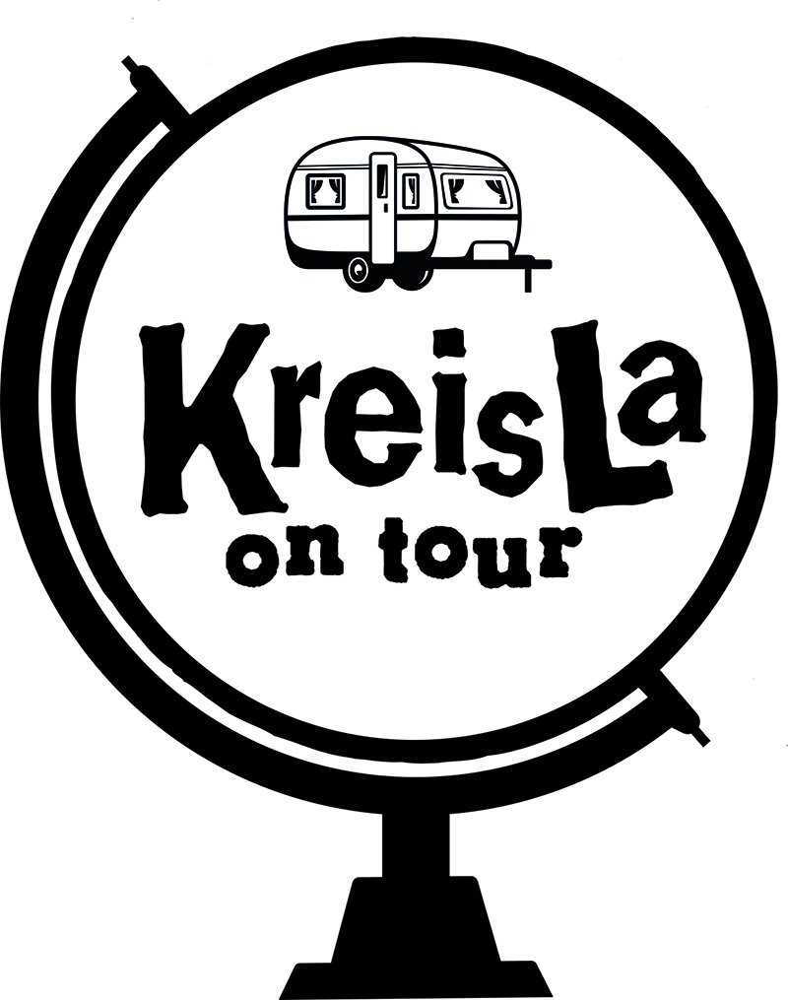
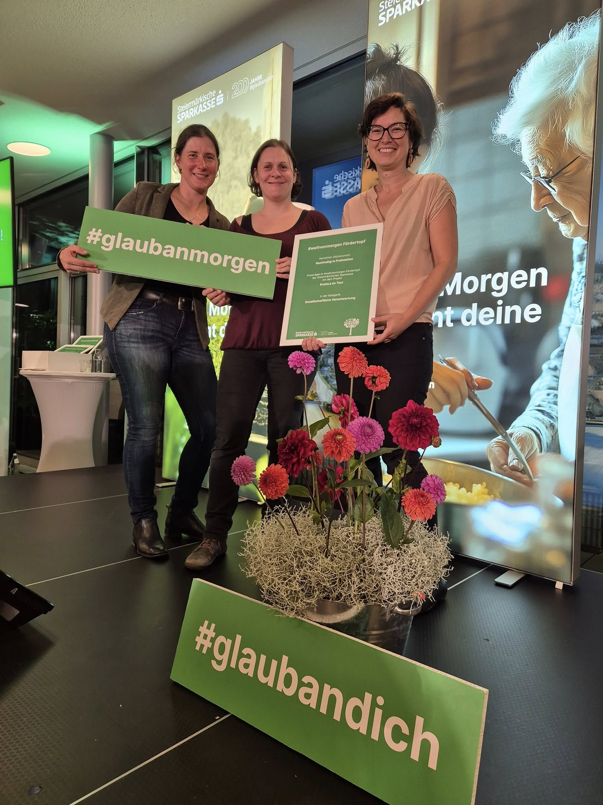
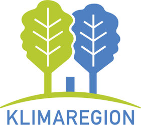

**Mobiler Kostnixladen – Der KreisLa on Tour reist durch die Nachbargemeinden**                                    

Mit unserem neuen Projekt „KreisLa on Tour“ entsteht derzeit ein mobiler Kostnixladen: Ein umgebauter Wohnwagen wird künftig als mobile Tauschstätte durch Nachbargemeinden reisen.
Der Anhänger wird jeweils etwa eine Woche pro Gemeinde unterwegs sein und dort die Möglichkeit zum Tauschen, Weitergeben und Wiederverwenden bieten, bevor er weiterzieht. So möchten wir noch mehr Menschen für Nachhaltigkeit und gemeinschaftliches Teilen begeistern.
Umgesetzt wird das Projekt gemeinsam mit der "Klimaregion Gu-Nord". Finanielle Unterstützung erhalte wir von der Steiermärkischen Sparkasse, wo wir beim #weltvonmorgen - Fördertopf eine Förderung erhalten haben, womit wir dieses Projekt umsetzen können. 

       

  
