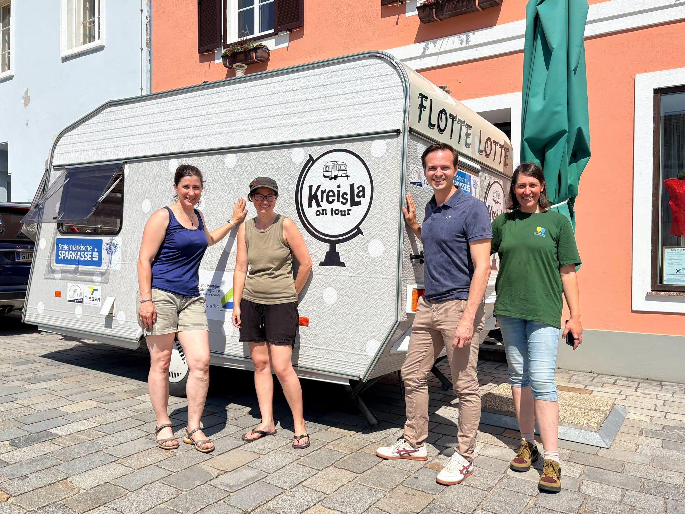
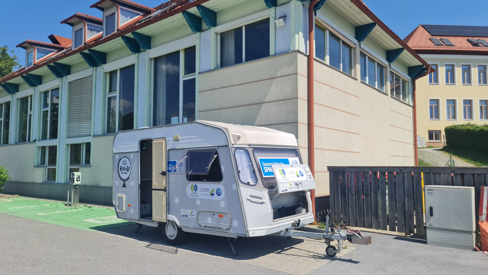
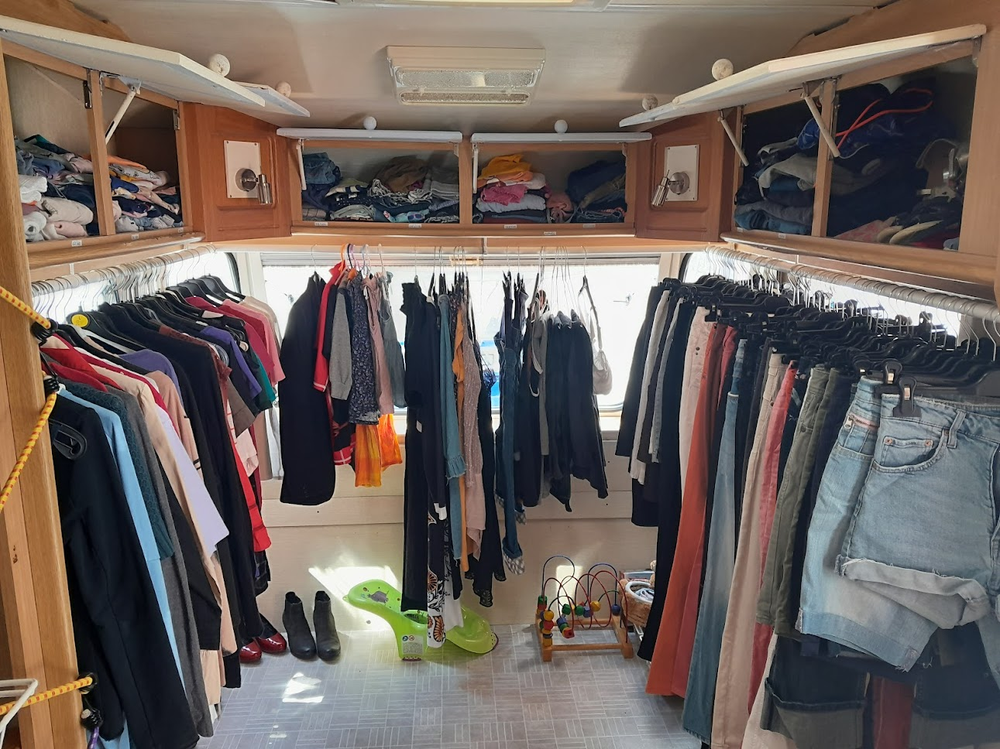

**Mobiler Kostnixladen – Der KreisLa on Tour reist durch die Nachbargemeinden**                                    

Mit unserem neuen Projekt „KreisLa on Tour“ ist im Juni 2026 ein mobiler Kostnixladen entstanden: Ein umgebauter Wohnwagen reist als mobile Tauschstätte durch Nachbargemeinden (Semriach, Übelbach, Peggau, Deutschfeistritz).
Der Anhänger wird jeweils etwa eine Woche pro Gemeinde unterwegs sein und dort die Möglichkeit zum Tauschen, Weitergeben und Wiederverwenden bieten, bevor er weiterzieht. So möchten wir noch mehr Menschen für Nachhaltigkeit und gemeinschaftliches Teilen begeistern.
Umgesetzt wird das Projekt gemeinsam mit der "Klimaregion Gu-Nord". Die Anschaffung des Wohnwagens wurde durch eine Förderung der Steiermärkischen Sparkasse ermöglicht. Das Projekt wurde im Rahmen der Jubiläumsinitiative #weltvonmorgen ausgezeichnet.

       

  
